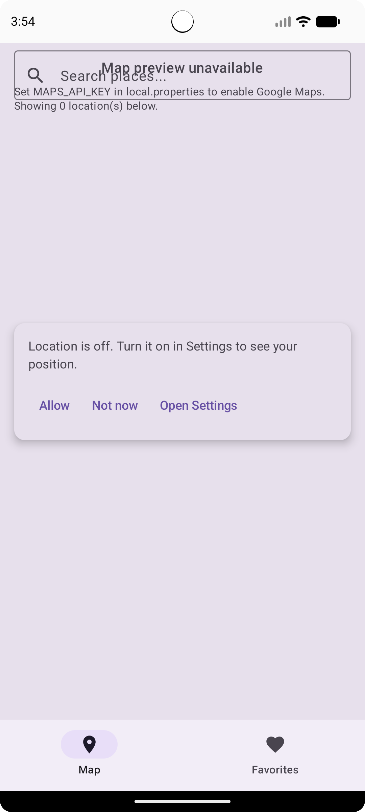

# MapTest Framework

A production-style Android Maps app paired with a comprehensive test-automation framework. Demonstrates offline-first data flow, Compose UI, Hilt-based DI for swapping test doubles, and a Page-Object-style instrumented test architecture.

---

## Running the App

The app launches without a Google Maps API key - when `MAPS_API_KEY` is empty in `local.properties`, the UI renders a fallback surface instead of crashing. This is intentional: the framework is runnable on any machine without secret provisioning.



What the screenshot shows:
- **Graceful degradation** - `MapScreen` checks `BuildConfig.MAPS_API_KEY.isBlank()` and swaps the `GoogleMap` composable for `MapFallbackSurface` instead of throwing on a missing key.
- **Permission state handling** - the rationale card with Allow / Not now / Open Settings is the `PERMISSION_LOCATION_DENIED_CARD` branch firing.
- **Compose navigation** - Map / Favorites bottom bar is wired through `NavHost` with Hilt-injected ViewModels.
- **Clean install** - APK builds with AGP 8.2.2 + Gradle 8.13 + Kotlin 1.9.22 + KSP, no manifest merger errors.

To enable the real map, drop a key into `local.properties`:
```
MAPS_API_KEY=AIza...
```
No code changes needed - the key flows from `local.properties` → `buildConfigField` + `manifestPlaceholders` → `MapScreen` at runtime.

---

## What This Project Demonstrates

- **Android Maps app development** with the Google Maps SDK
- **Test automation framework design** (Page Object Model, test data builders, helpers)
- **Espresso + Compose UI testing** with Hilt-managed test doubles
- **Practical use of common data structures** (LRU cache, graph traversal, trie, binary search) in real code paths
- **Offline-first architecture** (Room + connectivity handling)
- **CI readiness** (GitHub Actions integration, stable selectors, flake reduction)

---

## Architecture Overview

```
┌─────────────────────────────────────────────┐
│                    UI Layer                  │
│  MapScreen | SearchScreen | FavoritesScreen  │
│         (Jetpack Compose + Test Tags)        │
├─────────────────────────────────────────────┤
│               ViewModel Layer                │
│     MapViewModel (StateFlow + UDF)           │
├─────────────────────────────────────────────┤
│              Repository Layer                │
│   LocationRepository (single source of truth)│
├──────────────────┬──────────────────────────┤
│   Local (Room)   │   Remote (Retrofit)       │
│   LocationDao    │   PlacesApiService        │
│   LRU Cache      │                           │
└──────────────────┴──────────────────────────┘
```

## Test Architecture

```
┌─────────────────────────────────────────────┐
│              Test Layer                       │
├─────────────────────────────────────────────┤
│  tests/           → Actual test classes       │
│  framework/                                   │
│    ├── base/      → BaseTestCase              │
│    ├── pages/     → Page Objects (POM)        │
│    ├── helpers/   → Location, Network, Perms  │
│    ├── data/      → Test Data Builders        │
│    └── rules/     → Custom JUnit Rules        │
├─────────────────────────────────────────────┤
│  Unit Tests (test/)                           │
│    ├── ViewModel tests                        │
│    ├── Repository tests                       │
│    ├── LRU Cache tests                        │
│    └── Route Validator tests                  │
└─────────────────────────────────────────────┘
```

---

## Test Strategy

The framework is structured around three principles:

**1. Stable selectors over fragile ones.** Compose `testTag`s and resource IDs only - no text-based matching, no XPath. When a designer changes copy, tests don't break.

**2. Test doubles via DI, not mocks at the call site.** Hilt's `@UninstallModules` + `@BindValue` swaps the real `LocationRepository` for a fake at the module boundary. ViewModels and screens never know they're being tested. This scales cleanly across many features.

**3. Determinism by construction.** `animationsDisabled = true` in `testOptions`, in-memory Room for DAO tests, `MockWebServer` for network, `kotlinx-coroutines-test` for coroutines. No `Thread.sleep`, no flaky waits.

| Layer | Tool | Why this tool |
|---|---|---|
| Unit (JVM) | JUnit 4 + MockK + Truth + Turbine | Fast, Kotlin-native, Flow-aware |
| Integration (DB) | Room in-memory + JUnit | Real SQL, zero device dependency |
| Network | OkHttp `MockWebServer` | Real HTTP stack, deterministic responses |
| UI (instrumented) | Compose UI Test + Espresso + Hilt test rules | First-class Compose semantics + Hilt injection |
| Page Objects | Custom POM in `framework/pages/` | Hides selectors, exposes intent |

---

## Tech Stack

| Technology | Why |
|---|---|
| **Kotlin** | Industry standard for Android. |
| **Jetpack Compose** | Modern Android UI. Tests use Compose Semantics + test tags. |
| **Google Maps SDK** | Maps rendering and marker management. |
| **Room** | Offline-first caching - maps apps need to work without network. |
| **Hilt** | Dependency injection - makes testing possible by swapping real → fake. |
| **Coroutines/Flow** | Async operations - location updates, network calls, DB queries. |
| **Espresso** | Android UI testing framework. |
| **Compose UI Testing** | Testing Compose screens with semantics. |
| **MockK** | Kotlin-native mocking - cleaner than Mockito for Kotlin code. |
| **JUnit 4** | Android instrumented tests still primarily use JUnit 4. |
| **Page Object Model** | Reduces duplication, improves maintenance. |

---

## Data Structures Used

| Concept | Where It's Used |
|---|---|
| **HashMap** | Location caching, search history |
| **LRU Cache** | Map tile/location cache (LinkedHashMap + DLL) |
| **Binary Search** | Finding nearest location from sorted list |
| **BFS/DFS** | Route pathfinding between locations |
| **Queue** | Location update event processing |
| **Sliding Window** | Flaky test detection over recent runs |
| **Sorting** | Ordering locations by distance |
| **Trie** | Location search autocomplete |

---

## Setup Instructions

1. Clone this repo
2. Open in Android Studio (Hedgehog or newer - bundles JDK 17, which AGP 8.2 requires)
3. (Optional) Add a Google Maps API key in `local.properties` - leave blank to use the fallback UI:
   ```
   MAPS_API_KEY=your_key_here
   ```
4. Sync Gradle and run the app on an API 26+ emulator
5. To run tests:
   ```bash
   # Unit tests (JVM, fast)
   ./gradlew test

   # Instrumented tests (needs emulator/device)
   ./gradlew connectedAndroidTest
   ```

---

## Author
**Arul Michael Antony Felix Raja**
GitHub: [arulmickel](https://github.com/arulmickel)
